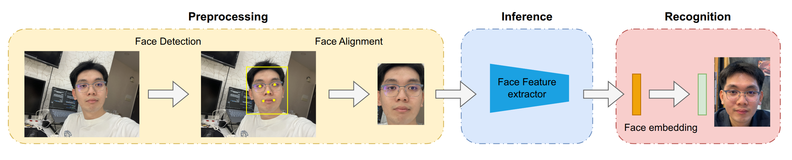
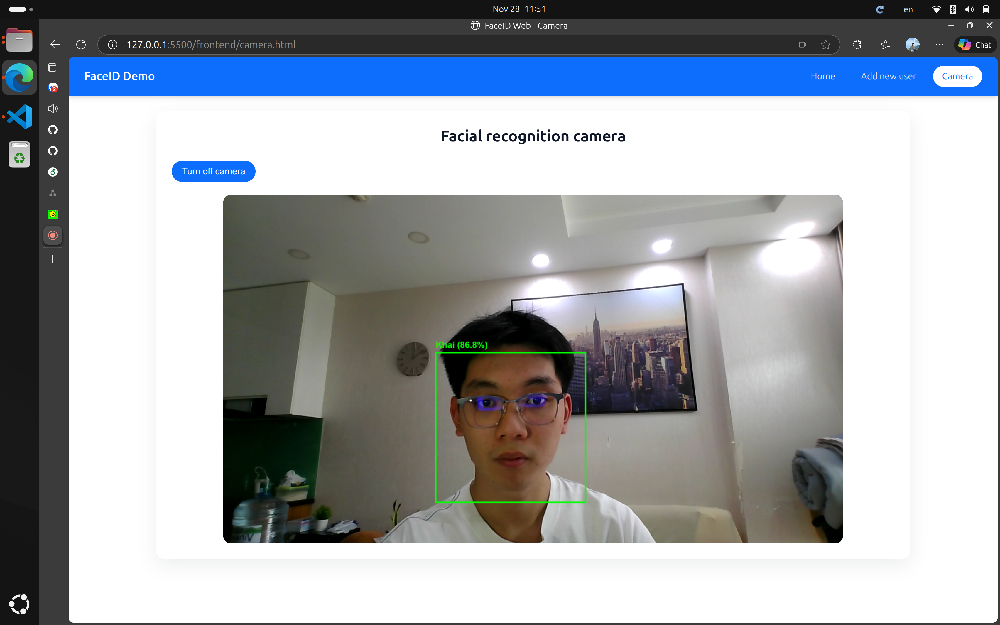

<h1 align="center">FaceID System: Real-time Web-Based Facial Recognition</h1>

## Introduction

This project implements a high-performance, real-time facial recognition system deployed on a web-based interface. The architecture employs a hybrid deep learning pipeline, utilizing MediaPipe for ultra-low latency detection and SCRFD for precise landmark-based geometric alignment. Feature extraction is powered by the industrial-grade ArcFace (ResNet100) backbone, integrated with Qdrant to facilitate millisecond-scale retrieval of high-dimensional embeddings.

<p align="center">
  <br/>
  <i>Pipeline of inference</i>
</p>


## Demo
<p align="center">
  <br/>
  <i>Video demo</i>
</p>

<p align="center">
  <br/>
  <i>Web app demo</i>
</p>

## Documentation
<details open>
<summary><b>1. Installation</b></summary>

Clone the repository and install dependencies in a [**Python>=3.8.0**](https://www.python.org/) environment. Ensure you have [**PyTorch>=1.8**](https://pytorch.org/get-started/locally/) installed.

```bash
# Clone the repository
git clone https://github.com/TrinhKhaii/FaceID.git

# Navigate to the cloned directory
cd FaceID

# Install required packages
pip install -r requirements.txt
```
</details>
<br>
<details open>

<summary><b>2. Dataset</b></summary>


This project utilizes a pre-trained ArcFace model for embedding extraction, which allows for robust recognition without the need for further training. As a result, the dataset comprises only the reference images of authorized users required for the matching process.
</details>
<br>
<details open>
<summary><b>3. Inference Usage</b></summary>

```bash
# 1. Initialize Vector Database (Qdrant)
docker run -d --name faceid_qdrant -p 6333:6333 -p 6334:6334 \
    -v $(pwd)/qdrant_storage:/qdrant/storage \
    qdrant/qdrant

# 2. Start Microservices Layer
chmod +x start_api_service.sh
./start_api_service.sh

# 3. Launch Main Application
python -m product.main

# 4. Launch Client Interface
cd frontend
python -m http.server 5500

```
- **Access URL**: http://localhost:5500
</details>

## Roadmap & Future Improvements

- **Speed Up Inference**: Switch the recognition model (ArcFace) to ONNX Runtime for 2-3x faster CPU performance.

- **Liveness Detection**: Integrate MiniFASNet to block fake faces (photos/videos) before processing.

- **Smart Sending**: Use MediaPipe JS in the browser to detect faces locally. Only send images to the server when a face is actually present.

- **Bandwidth Saving**: Limit server requests to 2-3 times per second (throttling) instead of streaming every single frame.

## References

[1] [A Survey of Face Recognition](https://arxiv.org/abs/2212.13038).  
[2] [Going Deeper Into Face Detection: A Survey](https://arxiv.org/abs/2103.14983).  
[3] [A survey and classification of face alignment methods based on face models](https://arxiv.org/abs/2311.03082).  
[4] [Deep Face Recognition: A Survey](https://arxiv.org/abs/1804.06655).  